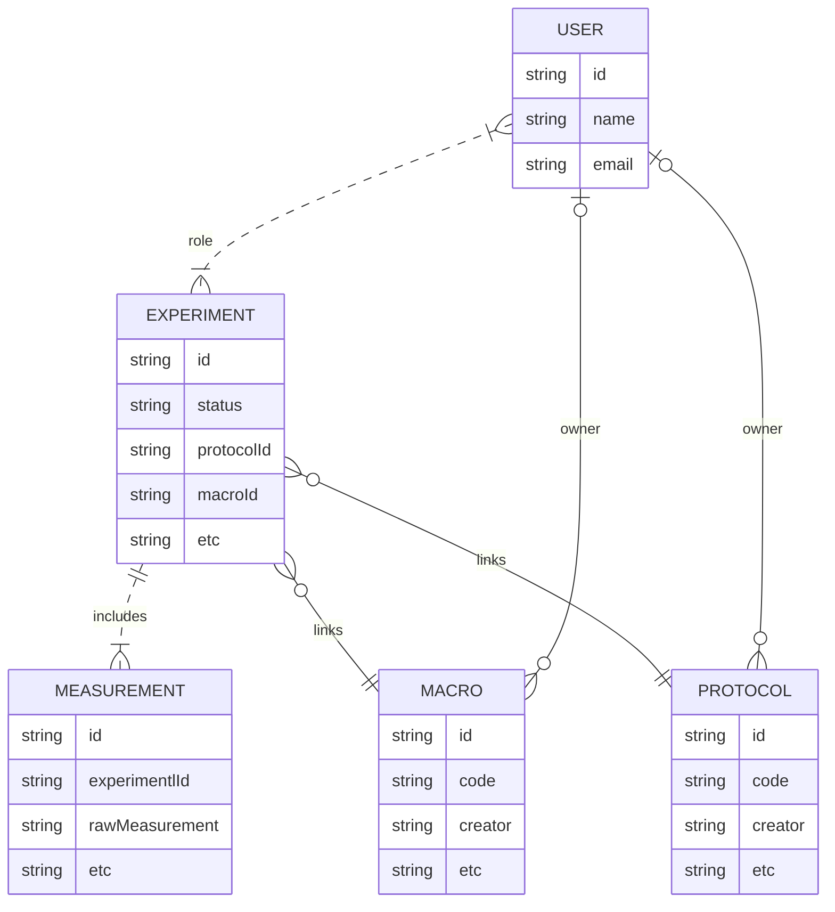

```mermaid
erDiagram
    USER }|..|{ EXPERIMENT : role
    EXPERIMENT ||..|{ MEASUREMENT : includes
    EXPERIMENT }o--|| MACRO : links
    EXPERIMENT }o--|| PROTOCOL : links
    USER |o--o{ MACRO : owner
    USER |o--o{ PROTOCOL : owner
    USER {
        string id
        string name
        string email
    }
    EXPERIMENT {
        string id
        string status
        string protocolId
        string macroId
        string etc

    }    
    MEASUREMENT {
        string id
        string experimentlId
        string rawMeasurement
        string etc
    }
    PROTOCOL {
        string id
        string code
        string creator
        string etc
    }
    MACRO {
        string id
        string code
        string creator
        string etc
    }

```
