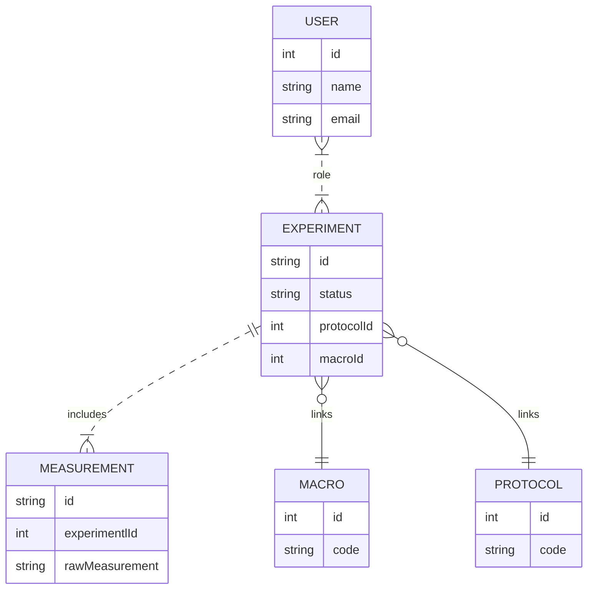

```mermaid
erDiagram
    USER }|..|{ EXPERIMENT : role
    EXPERIMENT ||..|{ MEASUREMENT : includes
    EXPERIMENT }o--|| MACRO : links
    EXPERIMENT }o--|| PROTOCOL : links
    USER {
        int id
        string name
        string email
    }
    EXPERIMENT {
        string id
        string status
        int protocolId
        int macroId
    }    
    MEASUREMENT {
        string id
        int experimentlId
        string rawMeasurement
    }
    PROTOCOL {
        int id
        string code
    }
    MACRO {
        int id
        string code
    }

```
